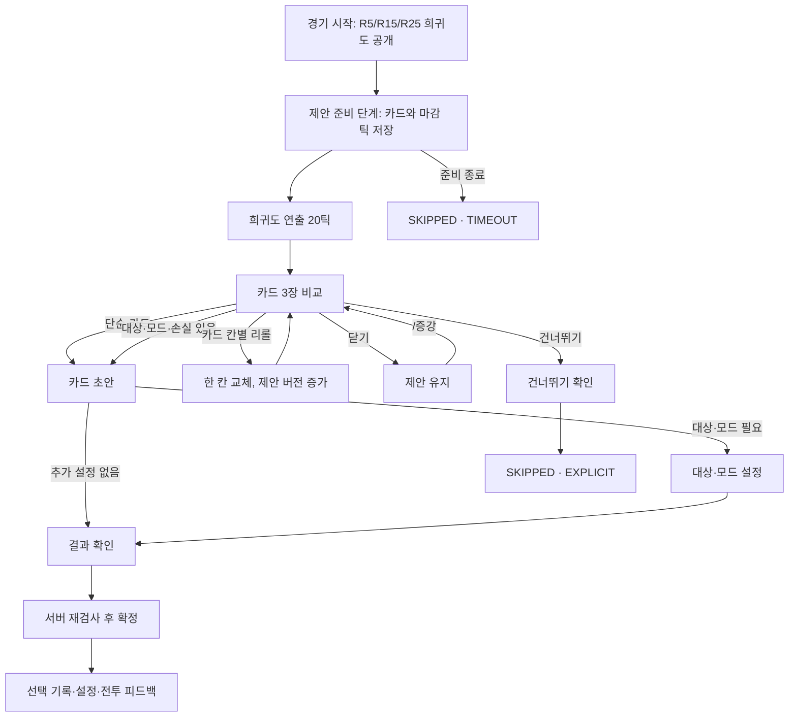

# 세미온 TD 시즌 3 증강 GUI 상세 명세

> 기준일: 2026-09-05 · 기준 브랜치: `s3-release` · 적용 모드: `NORMAL` · 상태: 서버 Dialog 구현·검증 중. 실제 클라이언트 검증은 별도로 기록한다.

이 문서는 증강의 화면, 입력, 시간 제한과 서버 검증 규칙을 정의한다. 카드 효과와 적격 조건은 [시즌 3 증강 시스템 명세](./2026-09-03-season-3-augment-design.ko.md)를 따른다. 두 문서가 충돌하면 카드 규칙은 증강 시스템 명세를, 화면 동작은 이 문서를 기준으로 삼는다.

처음 구현하는 개발자는 1절의 결정을 확인한 뒤 5절의 흐름, 6절의 화면, 8절의 서버 계약, 11절의 구현 순서대로 읽는다.

## 1. 결정 요약

| 항목 | H0 결정 |
|---|---|
| 표시 방식 | Minecraft 1.21.8의 서버 전송형 `Dialog` |
| 주 화면 | 기존 `MultiActionDialog`에 카드 설명 세 개와 3열 버튼 배치 |
| 카드 아이콘 | 바닐라 아이템만 사용하는 `ItemBody`. 텍스트에도 카테고리를 함께 표시 |
| 카드 공개 | 희귀도를 먼저 알리고 20틱 뒤 세 장을 동시에 표시 |
| 선택 | 첫 클릭은 초안만 저장. 모든 카드는 결과 화면에서 확정 |
| 리롤 | 경기당 1회. 고른 카드 칸 한 장만 교체하고 나머지 두 장은 유지 |
| 닫기 | 제안과 초안을 유지. 건너뛰기로 처리하지 않음 |
| 시간 초과 | 결과는 `SKIPPED`, 사유는 `TIMEOUT`으로 기록하고 효과를 주지 않음 |
| 다시 열기 | `/증강` 또는 `/semiontd augment ui` |
| 준비 시간 | 증강 선택 30초를 기존 준비 25초 앞에 추가해 총 55초. 추가 30초 동안만 전원의 에메랄드 자동 생산 중단. 그 밖의 준비 단계는 기존 25초 |
| 클라이언트 요구 | 클라이언트 모드와 리소스 팩 불필요 |

인벤토리형 GUI, 새 클라이언트 화면, 카드별 GUI 클래스와 화면 프레임워크는 만들지 않는다. 현재 서버가 이미 쓰는 다이얼로그와 명령 처리 방식을 확장하는 것이 가장 작은 구현이다.

현재 공개 무작위 카드 풀은 닫혀 있다. 일반 후보 35장과 후보 부족용 예비 보상 9장을 구현하며, 내부 강제 제안으로 GUI를 검증한다. 공개 풀 활성화는 자동 테스트 통과와 별개의 결정이다.

## 2. 현재 코드에서 재사용할 것

| 현재 경계 | 재사용 방법 |
|---|---|
| `SemionDialogService.showActions` | `MultiActionDialog` 생성과 전송 |
| `SemionDialogService.actionButton` | 버튼을 서버 명령으로 연결 |
| `PlainMessage`, `ItemBody` | 카드 설명과 바닐라 아이콘 표시 |
| `MultiActionDialog` | 카드 비교, 대상·모드 선택과 마지막 확인 |
| `SemionHudTextService` | 화면을 닫은 동안 남은 시간과 미선택 상태 표시 |
| `SemionText` | 성공, 실패와 다음 행동 안내 |
| `AugmentService` | 제안, 초안, 리롤, 확정과 만료의 유일한 판정자 |
| `PlayerAugmentState` | 제안, 초안, 마감 틱과 처리한 요청 식별자 저장 |

`SemionDialogService`는 상태를 바꾸지 않고 현재 서버 상태를 그린다. `SemionCommands`는 버튼 입력을 `AugmentService`로 전달한다. UI 코드는 선택 가능 여부를 판단하거나 효과를 적용하지 않는다.

기본 준비 시간은 `SemionGame.DEFAULT_PREPARE_TICKS`의 25초다. `startPreparePhase`는 살아 있는 플레이어의 미확정 제안을 하나 이상 만들면 그 앞에 선택 시간 30초를 추가한다. `currentPrepareDurationTicks`는 총 55초이며, `tickPrepare`와 `remainingPrepareSeconds`가 함께 사용한다. `augmentSelectionDurationTicks`로 추가 시간의 종료를 구분하며 별도 `AUGMENT_PHASE`는 만들지 않는다. `EconomyService.tickEmerald`는 이 추가 시간 동안 자동 생산을 지급하지 않는다. 일반 준비가 시작되면 생산을 재개하고, 중단한 생산량을 나중에 보충하지 않는다.

## 3. 경험 목표와 설계 근거

증강 화면은 플레이어가 현재 보드와 다음 웨이브를 보고 운영 규칙 하나를 결정하도록 돕는다.

### 3.1 MDA

| 층 | GUI에 적용하는 내용 |
|---|---|
| Mechanics | 세 장 제안, 같은 희귀도, 카드 칸별 리롤 1회, 시간 제한, 대상·모드 선택 |
| Dynamics | 현재 보드 비교, 좋은 카드 보존, 약한 카드만 교체, 다음 웨이브 대비, 상대 선택 정찰 |
| Aesthetics | 도전, 발견, 자기표현, 프리즘 공개의 기대감, 확정 순간의 해소 |

카드 칸별 리롤은 괜찮은 후보를 남긴 채 약한 후보만 바꾸게 한다. 경기당 한 번이므로 지금 쓸지 R15·R25까지 남길지도 판단한다. 이 방향은 TFT가 전체 제안 리롤에서 카드 칸별 리롤로 바꾼 이유와 같다. [Riot Games: Runeterra Reforged Mechanics Overview](https://teamfighttactics.leagueoflegends.com/en-us/news/game-updates/runeterra-reforged-mechanics-overview/)

MDA의 원문은 규칙이 플레이 중 동역학을 만들고, 그 동역학이 감정적 경험으로 이어진다고 설명한다. 이 문서는 효과 목록보다 선택 전 비교와 선택 후 피드백을 함께 정의한다. [Hunicke, LeBlanc, Zubek: MDA](https://aaai.org/papers/ws04-04-001-mda-a-formal-approach-to-game-design-and-game-research/)

### 3.2 자기결정성이론과 흐름

| 요구 | 화면 설계 |
|---|---|
| 자율성 | 세 장, 카드 칸별 리롤, 건너뛰기, 대상과 모드 선택 |
| 유능감 | 실제 금액·체력·슬롯 계산, 적격 대상, 실패 이유, 전투 결과 피드백 |
| 관계성 | 확정한 카드명과 희귀도 공개, 팀이 읽을 수 있는 역할·연결 효과 |
| 흐름 | R5부터 R25까지 같은 조작 구조를 유지하고 카드 판단만 깊어지게 함 |

명확한 선택과 결과 피드백은 자율성과 유능감을 돕는다. [Ryan & Deci: Self-Determination Theory](https://selfdeterminationtheory.org/topics/application-basic-psychological-needs/)

선택지가 세 장인 이유를 보편적인 심리 법칙으로 주장하지 않는다. 선택 과부하 연구의 평균 효과는 상황마다 크게 달랐다. 세 장은 TFT와 세미온 TD의 비교 화면에 맞는 시작값이며, 선택 시간과 시간 초과율로 검증한다. [Scheibehenne, Greifeneder, Todd: Choice Overload Meta-analysis](https://scheibehenne.de/ScheibehenneGreifenederTodd2010.pdf)

### 3.3 게임의 세 요소

| 요소 | 플레이어에게 보이는 것 |
|---|---|
| 목표 | 다음 운영 규칙 한 장을 정한다. |
| 규칙 | 세 장 중 하나, 카드 칸별 리롤 한 번, 준비 종료 전 확정 |
| 피드백 | 선택 전 실제 예상값, 확정 영수증, 전투 중 진행도, 웨이브 종료 결과 |

## 4. 세 번의 이터레이션

### 4.1 1안: 45칸 인벤토리 GUI

세 카드를 아이템으로 놓고 하단에 리롤, 건너뛰기와 확정 버튼을 두는 안이다. 카드 세 장을 한 화면에 배치하기 쉽다.

다음 이유로 제외한다.

- SGUI의 슬롯 콜백은 오래된 화면의 클릭을 증강의 `offerRevision`으로 막아 주지 않는다.
- 숫자키 교환, 드래그, 더블 클릭과 커서 아이템 같은 인벤토리 입력을 추가로 검증해야 한다.
- 1.21.8에서는 서버가 보낸 일부 `ItemStack` 구성 요소가 컨테이너 클릭 패킷 해시에서 문제를 일으킨 전례가 있다.
- 카드 선택에는 컨테이너가 필요하지 않다. 기존 서버 다이얼로그가 같은 요구를 충족한다.

### 4.2 2안: 한 화면 즉시 선택 다이얼로그

세 카드 설명과 선택 버튼만 보여 주고 모든 카드를 한 번에 확정하는 안이다. 구현은 가장 작지만 다음 문제가 있다.

- 영구 손실과 현재 계산값이 긴 본문에 섞인다.
- 타워 대상과 모드를 선택한 뒤 무엇을 확정하는지 다시 확인하기 어렵다.
- 화면이 열리기 직전의 클릭이 첫 카드 선택으로 이어질 수 있다.
- 카드 유형별로 대상·모드 입력을 이어 갈 경로가 없다.

### 4.3 3안: 계층형 서버 다이얼로그

최종안이다. 주 화면에서 세 장을 비교하고 첫 클릭으로 초안을 만든다. 단순 카드는 바로 결과 확인으로 가고, 추가 판단이 필요한 카드만 대상·모드 화면을 거친다.

| 카드 유형 | 버튼 입력 수 | 처리 |
|---|---:|---|
| 단순 카드 | 2 | 카드 → 확정 |
| 모드 카드 | 3 | 카드 → 모드 → 확정 |
| 대상 1기 | 3 | 카드 → 대상 → 확정 |
| 대상 1기와 모드 | 4 | 카드 → 대상 → 모드 → 확정 |
| 대상 2기 | 4 | 카드 → 첫 대상 → 둘째 대상 → 확정 |
| 영구 손실 카드 | 2 | 카드 → 손익 확인 |

희귀도 공개 뒤 20틱 동안 선택창을 열지 않는다. 첫 입력은 초안만 바꾸고 두 번째 입력이 카드를 확정한다. TFT의 짧은 입력 잠금도 함께 적용해 화면 전환 직후의 클릭을 막는다. [Riot Games: Patch 12.17](https://teamfighttactics.leagueoflegends.com/en-us/news/game-updates/teamfight-tactics-patch-12-17-notes/)

## 5. 전체 흐름



### 5.1 경기 시작

- 서버는 희귀도 순서를 경기 상태에 먼저 저장한다.
- 플레이어에게 `R5 실버 · R15 골드 · R25 프리즘`처럼 한 번 알린다.
- `/증강`의 선택 기록 화면에서도 같은 순서를 확인할 수 있다.

### 5.2 증강 제안을 여는 준비 단계

- 생존 플레이어의 제안 카드 세 장과 `offerRevision`을 만든 뒤 선택 시간 30초와 일반 준비 25초를 차례로 진행한다. 준비 시작 틱을 `prepareStartTick`이라 하면 `inputAllowedTick=prepareStartTick+20`, `deadlineTickExclusive=prepareStartTick+30*20`이다. 제안 변경 요청은 `currentTick >= inputAllowedTick && currentTick < deadlineTickExclusive`일 때만 받는다.
- 추가 30초 동안 전원의 에메랄드 자동 생산을 멈춘다. 일찍 선택·건너뛰기·재접속을 해도 공통 종료 시점은 바뀌지 않는다. 생산 보너스와 R25 생산 배율도 중단 대상이다. 배치·구매와 별도 보상·환불 규칙은 유지하며, 이후 일반 준비 25초 동안 자동 생산을 재개한다.
- 희귀도 제목과 바닐라 소리를 먼저 보낸다. 20틱 뒤 같은 제안이 아직 유효할 때만 주 화면을 연다.
- 재접속과 수동 재열기에는 희귀도 연출과 입력 지연을 반복하지 않는다. 기존 `inputAllowedTick` 전에는 카드 화면을 열지 않고 남은 잠금 시간만 알린다.

중도 참여자의 예약된 R5 제안은 다음 준비 단계가 시작될 때 생성한다. 희귀도 연출 20틱 뒤 주 화면을 열며, 해당 라운드에도 전원이 선택 30초와 일반 준비 25초를 함께 사용한다.

### 5.3 선택 시간 종료와 일반 준비

- `currentTick >= deadlineTickExclusive`가 되면 미확정 제안의 결과를 `SKIPPED`, 사유를 `TIMEOUT`으로 기록하고 초안을 지운다. 이후 일반 준비 25초를 진행하고 `startWavePhase`에서 전투를 시작한다.
- 서버는 Escape와 다른 다이얼로그 전환을 알 수 없으므로 만료 때 전역 닫기 패킷을 보내지 않는다. 오래된 증강 버튼을 누르면 서버가 거절하고 종료 사실을 알린다.
- 마감 뒤 도착한 모든 상태 변경 명령인 초안 생성, 리롤, 대상·모드 변경, 확정, 건너뛰기는 상태를 바꾸지 않는다.
- 자동으로 카드를 고르지 않는다.

## 6. 화면별 명세

### 6.1 희귀도 공개

| 희귀도 | 제목 | 보조 표기 |
|---|---|---|
| 실버 | `실버 증강` | 흰색 글자와 `minecraft:block.note_block.pling` |
| 골드 | `골드 증강` | 금색 글자와 `minecraft:entity.player.levelup` |
| 프리즘 | `프리즘 증강` | 연보라색 글자와 `minecraft:block.amethyst_block.chime` |

소리와 색만으로 정보를 전달하지 않는다. 화면 제목에 희귀도 이름을 쓴다. 연출은 한 번만 재생하며 선택 시간을 멈추지 않는다.

### 6.2 카드 선택 주 화면

제목은 `R15 증강 선택 · 골드 · 2/3` 형식으로 고정한다.

```text
R15 골드 증강
마감: 선택 시간 30초 종료 · 이후 일반 준비 25초 · 리롤 1회

[1] 과열 코어        [골드 · 대가형]
타워 한 기 선택 · 이번 웨이브 최종 피해 +40%
종료 뒤 영구 열화 -6%, 최대 5회 · 선택 가능 5기

[2] 지원 실적        [골드 · 인컴]
...

[3] 박동 중계기 설계도 [골드 · 전용 타워]
...
```

본문에는 `ItemBody` 세 개를 세로로 둔다. `showDecorations=false`, `showTooltip=false`로 두고 카드 설명은 함께 전달하는 `PlainMessage`에 쓴다. 아이콘은 카테고리를 나타낸다. 카드 설명은 다음 세 줄을 기준으로 작성한다.

1. 카드 번호, 카드명, 희귀도와 카테고리
2. 플레이어가 할 행동, 핵심 보상과 적용 시점
3. 대가와 실패 조건, 현재 적용 가능한 대상 수

영구 손실은 주 화면에서 생략하지 않는다. 세부 계산, 대상별 스택과 전체 충돌 목록은 기존 검토·결과 확인 화면에 둔다. 좁은 화면에서 줄바꿈이 생겨도 내용을 잘라내지 않는다. `ItemBody` 툴팁은 사용하지 않는다.

| 카테고리 | 바닐라 아이콘 | 텍스트 표기 |
|---|---|---|
| 범용 | 나침반 | `[범용]` |
| 대가형 | 사슬 | `[대가형]` |
| 전용 타워 | 비계 | `[전용 타워]` |
| 게임 체인저 | 네더의 별 | `[게임 체인저]` |
| 인컴 | 에메랄드 | `[인컴]` |

아이콘에는 이름·설명 같은 커스텀 구성 요소를 넣지 않는다. 카드 정보는 `PlainMessage` 설명에 둔다.

버튼은 3열로 고정한다.

```text
[1 과열 코어 검토] [2 지원 실적 검토] [3 박동 중계기 검토]
[리롤]            [선택 기록]       [도움말]
[건너뛰기]                          [닫기]
```

- `검토` 버튼은 초안이 없으면 해당 카드의 초안을 만든다. 같은 카드의 초안이 있으면 대상·모드·버전을 유지하고 완료하지 않은 단계부터 연다. 다른 카드를 검토할 때만 기존 초안을 바꾼다. 이 단계에서는 카드 효과를 적용하지 않는다.
- `리롤`은 카드 칸 선택 화면을 연다. 카드 한 장을 실제로 교체할 때만 경기당 1회를 소비한다.
- `선택 기록`은 R5·R15·R25 결과를, `도움말`은 희귀도·카테고리·리롤·시간 초과 규칙을 읽기 전용으로 보여 준다.
- `SAFE`는 내부 제안 규칙이다. 추천 배지로 표시하지 않는다.
- `닫기`는 명령을 보내지 않는다.
- 다이얼로그 본문에는 고정된 남은 초를 표시하지 않는다. 실시간 값은 기존 HUD 한 줄에서 갱신하고 10초·5초에 글자와 소리로 경고한다. 매초 화면을 다시 보내지 않는다.

### 6.3 카드 칸별 리롤

`리롤`을 누르면 사용 시점의 의미와 카드 세 장을 다시 보여 준다.

```text
이번에 사용하면 이후 마일스톤에는 리롤이 남지 않습니다.

[1번 카드만 리롤] [2번 카드만 리롤] [3번 카드만 리롤]
[카드로 돌아가기]
```

카드 칸을 고르면 다음 순서로 처리한다.

1. 서버가 리롤 잔여 횟수, 단계, 마감과 `offerRevision`을 확인한다.
2. 고른 칸의 카드를 제외하고 다른 두 칸은 그대로 둔다.
3. 이미 본 카드, 현재 부적격 카드와 이미 보유한 카드에 충돌하는 카드를 제외한다. 보존한 두 카드와는 ID·계보 중복만 막고 하드 충돌은 허용한다. 교체 뒤에도 `SAFE` 최소 한 장과 대가형·불가역 게임 체인저 합계 최대 한 장을 유지한다.
4. 저장된 시드와 같은 입력값에서 항상 같은 카드가 나오도록 유효 후보 한 장을 골라 같은 칸에 넣는다.
5. `offerRevision`을 올리고 열려 있던 초안을 지운다.
6. 리롤을 사용한 새 화면을 연다.

고른 칸이 제안의 유일한 `SAFE` 카드이고 이를 대신할 유효한 `SAFE` 카드가 없으면 카드 칸 선택 화면에 해당 버튼을 만들지 않는다. 교체 후보가 없는 칸도 숨기고 이유를 본문에 적는다. 리롤은 소비하지 않는다.

별도 확인창은 두지 않는다. 카드 칸 선택 화면이 사용 시점과 교체 대상을 함께 확인하는 단계다. 버튼 이름에는 `1번 카드만 리롤 · 경기당 1회 즉시 소비`처럼 결과를 적는다.

### 6.4 대상 선택

대상 화면에는 적격 타워만 표시한다. 상단에는 `선택 가능 5기 · 제외 2기: 자동 전역 1, 열화 한도 1`처럼 제외 수와 대표 이유를 요약한다.

타워 버튼은 `#2 · 화염술사 T3 · X 120/Z -33`처럼 표시한다.

- `#2`는 `originalPosition`의 X, Z, Y 순으로 정렬한 현재 화면의 임시 번호다.
- 화면 번호는 표시용이다. 명령에는 논리 타워 UUID를 넣는다.
- 버튼 설명에는 현재 스택, 선택 뒤 수치와 제외될 상태를 표시한다.
- 보드가 바뀌면 서버가 UUID와 적격을 다시 검사한다.
- 대상이 많으면 다이얼로그의 기본 스크롤을 사용한다. 검색과 페이지 상태는 만들지 않는다.

부적격 타워 전체를 버튼으로 늘어놓지 않는다. 어떤 타워가 제외됐는지 이해하지 못했다는 피드백이 반복될 때만 `제외 대상 보기`를 추가한다.

### 6.5 모드와 복수 대상

모드는 버튼으로 고른다. `SingleOptionInput`과 새 입력 템플릿은 쓰지 않는다.

| 카드 | 순서 |
|---|---|
| 전술 지명 | 타워 → `돌격` 또는 `엄호` → 결과 확인 |
| 교전 계획 | `속전` 또는 `지구전` → 결과 확인 |
| 전열 분업 | 선봉 → 포대 → 결과 확인 |
| 편향 장갑 | `물리 편향` 또는 `마법 편향` → 결과 확인 |

`뒤로`는 직전 단계로 가고 초안을 보존한다. `다른 카드 보기`는 제안 주 화면으로 돌아가되 초안을 보존한다. 다른 카드를 검토하면 기존 초안을 새 카드 초안으로 바꾼다. 초안은 자원, 카드 효과, 이용권과 타워를 바꾸지 않는다.

카드를 처음 선택하면서 대상 또는 모드를 확정하면 해당 카드가 그 준비 단계에 가진 1회 설정 기회를 소비한다. 이후에도 카드별로 준비 단계마다 한 번 바꿀 수 있으며, 설정 변경을 확정했을 때만 기회를 소비한다. 화면 열기, 초안 변경, 취소와 대상 자동 무효화는 설정 기회를 소비하지 않는다.

### 6.6 결과 확인

모든 카드는 두 개의 행동 버튼을 둔 `MultiActionDialog`에서 마지막으로 확정한다. 단순 카드는 카드명과 핵심 효과만 보여 준다. 다음 조건이 있는 카드는 보상과 손실을 현재 값으로 풀어 쓴다. Escape와 `닫기`는 초안을 보존한다.

- 타워나 타워 귀속 스택을 영구 제거한다.
- 미래 다이아 지급, 개인 타워 한도 또는 영구 능력치를 낮춘다.
- 대상이나 모드를 확정해야 효과가 성립한다.

버튼에는 추상적인 `예/아니요` 대신 실행 결과를 쓴다.

```text
명예 퇴역

제거   별의 마도사 T3
환급   245다이아
손실   귀속 상태 전부, 타워 한도 8 → 7
보상   현재와 이후 일반 타워 피해·최대 체력 +20%

[명예 퇴역 확정] [다른 카드 보기]
```

`다른 카드 보기`는 아무 상태도 소비하지 않고 초안을 보존한 채 제안 주 화면으로 돌아간다.

### 6.7 건너뛰기

건너뛰기는 이번 마일스톤의 증강 선택 기회를 잃는 불가역 행동이므로 한 번 더 확인한다.

```text
R15 골드 증강을 건너뜁니다.
이번 마일스톤에서는 카드를 받지 못하며 되돌릴 수 없습니다.

[증강 없이 진행] [카드로 돌아가기]
```

확정하면 결과를 `SKIPPED`, 사유를 `EXPLICIT`으로 기록한다. 텔레메트리에서는 시간 초과와 구분한다.

### 6.8 선택 기록과 설정 화면

선택을 마친 뒤 `/증강`은 세 마일스톤 기록을 연다.

```text
R5  [실버] 전술 지명 I · 화염술사 T3 · 돌격
R15 [골드] 지원 실적 · 누적 +4/+8
R25 [프리즘] 아직 선택하지 않음
```

- 설정 가능한 카드는 `설정 변경` 버튼을 표시한다.
- 일반 준비 단계가 시작되면 HUD에 `교전 계획: 지구전 유지 · /증강 설정`처럼 현재 설정과 진입 명령을 표시한다. 지속형 대상·모드는 바꾸지 않으면 직전 설정을 유지한다.
- `과열 코어`는 매 준비 단계 시작에 `이번 웨이브 미사용`으로 초기화한다. 그 준비 단계에 대상을 확정했을 때만 발동한다. 처음 카드를 고르면서 대상을 확정한 경우도 이번 웨이브 사용으로 처리한다. 지정하지 않으면 피해 증가와 추가 열화를 적용하지 않으며, 기존 열화는 남는다.
- 대상이 사라지면 임의 타워를 자동 지정하지 않는다. `설정 필요`로 바꾸고 효과를 끈다.
- 설계도와 호출은 기존 타워 설치 화면에 새 항목으로 나타난다.
- 인컴 카드는 기존 소환 상점의 `인컴 계약` 화면에서 설정한다.
- 준비 중인 대상과 모드는 본인과 팀원에게만 보낸다. 상대와 관전자에게는 웨이브 시작에 잠근 결과를 동시에 공개한다. 미확정 제안, 리롤, 요청 식별자와 비공개 계산값은 보내지 않는다.

설정 변경은 완료된 제안의 `offerRevision`을 재사용하지 않는다. 다음 절차를 따른다.

1. 서버는 선택 기록의 1~3번 칸으로 확정 카드를 찾고, 설정 가능한 카드인지와 이번 준비 단계의 설정 기회가 남았는지 검사한다.
2. 같은 카드의 설정 초안이 있으면 대상·모드·`configurationRevision`을 유지하고 재개한다. 초안이 없거나 다른 카드의 설정을 열면 현재 대상·모드를 복사한 초안으로 바꾸고 `configurationRevision`을 올린다.
3. 대상이나 모드를 바꿀 때마다 `configurationRevision`을 다시 올린다. 이때 실제 효과는 바꾸지 않는다.
4. 설정 확정 요청이 성공하면 현재 설정과 `lastConfiguredRound`를 함께 바꾼다. 선택 당시의 대상·모드 확정도 해당 카드의 `lastConfiguredRound`를 현재 라운드로 기록한다.
5. 웨이브 시작에는 현재 설정을 전투 스냅샷에 넣고 미확정 설정 초안을 지운다. 지속형 대상·모드는 직전 설정을 유지한다. `과열 코어`는 이번 준비 단계에서 사용을 확정한 대상만 스냅샷에 넣는다.

플레이어마다 설정 초안은 한 개만 둔다. 카드마다 별도 설정 세션이나 GUI 클래스를 만들지 않는다.

### 6.9 인컴 계약 화면

인컴 카드마다 소환 버튼을 복제하지 않는다. 기존 소환 상점에 `인컴 계약` 버튼 하나를 추가한다.

```text
다음 적격 구매 계약

몸체 보정  추가 적재: 켜짐
가치 계약  예고 공세

[추가 적재 켜기/끄기]
[계약 없음] [예고 공세] [현금 결제]
[소환 상점으로]
```

- `추가 적재`는 몸체 보정이라 가치 계약 하나와 함께 켤 수 있다.
- `예고 공세`와 `현금 결제`는 한 구매에 하나만 고른다.
- 각 계약 아래에는 적용 가능한 인컴 종류를 표시한다. 부적격 구매에는 `이 계약은 적용되지 않으며 그대로 유지됩니다.`를 표시한다.
- 선택은 다음 적격 구매에만 적용한다. 성공하면 해제하고, 실패하면 유지한다.
- `저압 계약`은 이 화면에서 미리 켜지 않는다. 적격 유닛을 누르면 구매 확인 화면에서 `일반 구매`와 `저압 계약 구매`의 실제 결과를 함께 보여 준다.
- `예고 공세`나 `현금 결제`가 켜져 있으면 `저압 계약 구매`를 숨기고 현재 가치 계약을 먼저 끄라는 이유를 표시한다.
- `지원 실적`은 자동 추적하므로 토글을 만들지 않는다.
- 준비 단계가 끝나면 사용하지 않은 계약을 모두 끈다.
- 소환 버튼과 구매 확인에는 `지금 비용`, `이번 웨이브 출현`, `영구 다이아 인컴 변화`, `즉시 다이아`와 `유닛 능력치 변화`를 계약 적용 뒤 실제 값으로 표시한다.

`LANE_WAVE` 예약 소환에서는 증강 계약 버튼을 숨기고 적용하지 않는다.

### 6.10 오류와 복구

오류 문구는 원인과 다음 행동을 함께 말한다.

| 상황 | 문구와 처리 |
|---|---|
| 오래된 제안 | `제안이 갱신되었습니다. 최신 카드로 다시 열었습니다.` |
| 대상 제거 | `선택한 화염술사 T3가 보드에서 제거되었습니다. 새 대상을 고르세요.` |
| 단계 종료 | `준비 단계가 끝나 이번 선택은 건너뛰기로 처리되었습니다.` |
| 충돌 발생 | `전술 지명과 전열 분업은 같은 타워에 적용할 수 없습니다.` |
| 비용 변경 | `현재 비용으로 조건을 충족하지 못합니다. 보드를 확인하세요.` |
| 반복 요청 | 추가 변경 없이 최신 선택 결과를 다시 표시 |

서버는 요청 처리에 실패해도 카드, 자원, 이용권, 리롤 횟수와 설정 기회를 소비하지 않는다. 제안이 유효하면 저장된 초안이 있을 때 해당 단계부터 다시 열고, 초안이 없을 때 제안 주 화면을 연다. 제안이 끝났으면 선택 기록 화면을 연다.

## 7. 카드별 화면 경로

| 카드 | 처음 고를 때 | 선택 뒤 조작 |
|---|---|---|
| 전술 지명 I·II·III | 타워 → 돌격/엄호 → 확인 | 준비 단계마다 대상·모드 변경 |
| 삼각 진형 | 효과 요약 → 확정 | 적용 타워 수 자동 표시 |
| 교전 계획 | 속전/지구전 → 확인 | 준비 단계마다 모드 변경 |
| 비상 융자 | 실제 수령·차감액 → 손익 확인 | 남은 부채와 다음 차감액 표시 |
| 접이식 방벽 설계도 | 해금 내용 → 확정 | 타워 설치 화면에서 구매 |
| 추가 적재 | 효과 요약 → 확정 | 인컴 계약에서 다음 구매 토글 |
| 과열 코어 | 타워 → 열화 결과 확인 | 사용할 준비 단계에만 대상 지정. 미지정이면 미사용 |
| 박동 중계기 설계도 | 해금 내용 → 확정 | 타워 설치와 상세에서 연결 후보 확인 |
| 전열 분업 | 선봉 → 포대 → 확인 | 준비 단계마다 두 역할 변경 |
| 예고 공세 | 효과 요약 → 확정 | 인컴 계약과 예약 내역 확인 |
| 지원 실적 | 효과 요약 → 확정 | HUD와 유닛 이름표에서 `2/3`, `+4/+8` 확인 |
| 금지된 설계도 | 이용권·정기 지급 감소 → 손익 확인 | 승급 화면에서 사용 여부 선택 |
| 명예 퇴역 | 최고 실결제 타워 확인, 동률이면 대상 선택 → 손익 확인 | 확정 뒤 재사용 불가 |
| 방벽 핵심 호출 | 슬롯·배치권 확인 → 확정 | 타워 설치 화면에서 1회 배치 |
| 과밀 허가 | 한도와 실제 배율 → 손익 확인 | 한도 구매 뒤 갱신된 배율 표시 |
| 저압 고수익 | 효과 요약 → 확정 | 인컴 계약에서 구매마다 선택 |
| 쌍둥이 편대 | 현재 활성 조합 수 → 확정 | 선택 기록과 타워 상세에서 활성 여부 확인 |
| 전장 숙련 | 타워 → 제거 시 손실 확인 | 대상 변경 불가, 스택 진행도 표시 |
| 편향 장갑 | 물리/마법 → 예상 피해 비교 → 확인 | 준비 단계마다 편향 변경 |
| 현금 결제 | 효과 요약 → 확정 | 인컴 계약에서 다음 구매 토글 |

카드 효과 수치는 증강 시스템 명세에서 관리한다. `AugmentCatalog`는 고정 문구를 제공하고 `AugmentService`는 현재 보드로 계산한 미리보기 값을 제공한다. GUI 코드는 두 값을 표시한다.

## 8. 서버 상태와 요청 계약

`requestId`는 서버가 상태 변경 버튼을 만들 때 명령에 넣는 일회성 식별자다. 플레이어가 같은 버튼을 빠르게 두 번 눌러도 첫 요청만 상태를 바꾼다.

### 8.1 `PlayerAugmentState`에 필요한 선택 상태

| 상태 | 저장 값 |
|---|---|
| 미확정 제안 | 마일스톤, 희귀도, 카드 ID 세 개, `offerRevision`, `deadlineTickExclusive`, `inputAllowedTick` |
| 리롤 | 남은 횟수, 이미 본 카드 ID, 교체한 카드 칸 |
| 제안 초안 | 카드 칸, `draftRevision`, 대상 UUID 최대 두 개, 모드 |
| 설정 초안 | 선택 기록 칸, `configurationRevision`, 대상 UUID 최대 두 개, 모드 |
| 카드별 설정 | 현재 대상·모드와 `lastConfiguredRound` |
| 요청 중복 방지 | `requestId`가 붙은 제안·설정 요청의 인자 지문과 처리 결과 |
| 완료 | 선택 카드 ID 또는 `SKIPPED`, `SKIPPED`일 때의 `skipReason`, 확정 틱 |

현재 화면 종류와 스크롤 위치는 저장하지 않는다. 재접속하면 서버가 저장된 제안과 초안을 바탕으로 다시 열 화면을 결정한다.

### 8.2 명령

버튼 명령은 입력 전달에만 쓴다. 서버는 현재 상태를 다시 검사해 요청의 수락 여부를 결정한다.

```text
/semiontd augment ui [current|offer|history|help]
/semiontd augment view <offer|configuration> <target|mode|confirm>
/semiontd augment draft <offerRevision> <slot> <requestId>
/semiontd augment reroll <offerRevision> <slot> <requestId>
/semiontd augment target <offerRevision> <draftRevision> <towerUuid>
/semiontd augment mode <offerRevision> <draftRevision> <mode>
/semiontd augment confirm <offerRevision> <draftRevision> <requestId>
/semiontd augment skip <offerRevision> <requestId>
/semiontd augment configure <selectionSlot> <requestId>
/semiontd augment configure-target <configurationRevision> <towerUuid>
/semiontd augment configure-mode <configurationRevision> <mode>
/semiontd augment configure-confirm <configurationRevision> <requestId>
```

사용자 UUID는 명령 인자로 받지 않고 명령을 실행한 플레이어에게서 얻는다. 카드 ID도 클라이언트가 보내지 않는다. 서버는 제안 카드 칸이나 선택 기록 칸에서 안정 ID를 찾는다. 관리자 강제 제안 명령은 별도 권한 노드로 제한한다. `ui`와 `view`는 읽기 전용이며, 현재 제안과 초안에서 열 수 있는 화면만 서버가 다시 그린다. `뒤로` 버튼은 `view`, `다른 카드 보기`는 `ui offer`를 사용한다.

`SemionCommands`에 한국어 별칭도 직접 등록한다. `/증강`은 `/semiontd augment ui current`, `/증강 설정`은 `/semiontd augment ui history`와 같은 화면을 연다. `current`는 미확정 제안이 있으면 제안 주 화면을, 없으면 선택 기록을 연다. 버튼이 보내는 내부 명령은 `/semiontd augment` 하나로 유지한다.

### 8.3 원자적 처리

`AugmentService`의 변경 메서드는 서버 스레드에서 아래 순서를 한 번에 수행한다.

1. 명령을 실행한 플레이어와 현재 경기를 확인한다.
2. `requestId`가 있으면 먼저 `(requestId, 작업 종류, 인자 지문)`을 조회한다. 같은 요청을 이미 처리했다면 상태를 바꾸지 않고 저장한 결과에 맞는 현재 화면을 보낸다. 같은 `requestId`에 다른 작업이나 인자가 붙으면 거절한다.
3. 생존 참가자, 게임 모드, 단계와 라운드를 확인한다. 제안 요청은 `inputAllowedTick`과 `deadlineTickExclusive`도 확인한다.
4. 제안 요청은 `offerRevision`과 필요한 `draftRevision`을, 설정 요청은 선택 기록 칸과 `configurationRevision`을 확인한다.
5. 카드 적격, 충돌, 설정 기회, 대상, 모드, 비용과 현재 보드를 다시 검사한다.
6. 변경 계획을 계산한다.
7. 요청 종류에 맞는 상태를 반영한다. 초안 생성과 대상·모드 변경은 해당 초안만, 리롤은 제안만, 건너뛰기는 완료 결과만 바꾼다. 카드 확정은 카드, 자원, 대상과 효과를 함께 반영하고, 설정 확정은 해당 카드의 현재 설정과 `lastConfiguredRound`를 함께 바꾼다.
8. `requestId`가 있는 작업이면 요청 지문과 결과를 저장한다.
9. 최신 화면 또는 영수증을 보낸다.

별도 락과 비동기 실행기를 만들지 않는다. 현재 게임 틱과 버튼 명령은 서버 스레드에서 직렬 처리된다. 비동기 작업을 나중에 추가한다면 결과 반영만 `server.execute`로 되돌린다.

### 8.4 오래된 요청

- 리롤이 성공하면 `offerRevision`이 증가한다. 이전 화면의 모든 버튼은 무효다.
- 초안을 처음 만들거나 다른 카드를 검토하면 `draftRevision`을 증가시킨다. 초안의 대상이나 모드가 바뀌어도 같은 버전을 증가시킨다. 같은 카드의 초안을 다시 여는 입력은 초안과 버전을 바꾸지 않는다. 설정 초안 재개도 같은 규칙을 따른다.
- 제안 초안 생성·리롤·카드 확정·건너뛰기와 설정 초안 생성·설정 확정에는 서버가 발급한 `requestId`를 넣는다. 같은 값이 다시 오면 상태를 다시 바꾸지 않고 첫 처리 결과에 맞는 현재 화면을 그린다. 대상·모드 요청은 해당 초안 버전이 한 번 성공할 때마다 증가하므로 반복된 이전 요청을 거절한다.
- 마감 뒤 도착한 요청은 HUD에 표시된 남은 시간과 관계없이 거절한다.
- 클라이언트가 명령을 직접 입력해도 같은 검증을 거친다.

### 8.5 닫기와 재접속

- Escape와 `닫기`는 서버 상태를 바꾸지 않는다.
- HUD에는 `R15 골드 증강 미선택 · 18초 · /증강`을 표시한다.
- 재접속은 `SemionGameManager.handlePlayerJoin`의 배치 복원 성공 분기에서 반환하기 전에 제안 복원을 호출한다. 자동 재개 전 생존 참가자, 유효한 미확정 제안과 남은 기한을 따로 검사한다.
- 마감이 남았으면 같은 카드, 버전, 초안과 `deadlineTickExclusive`를 복원하고 제안 주 화면을 연다. 초안 카드의 `검토`를 누르면 완료하지 않은 단계부터 이어 간다.
- 마감이 지났으면 `SKIPPED · TIMEOUT` 결과만 보여 준다.
- 일반 준비 단계에서 설정 초안이 남아 있으면 같은 선택 기록 칸과 `configurationRevision`을 복원한다. 웨이브가 시작됐으면 초안은 지우고 잠근 설정만 보여 준다.
- 서버 재시작 뒤 진행 경기 복구는 이번 범위가 아니다.

## 9. 피드백, 접근성, 공개 범위

### 9.1 피드백의 네 시점

| 시점 | 표시 |
|---|---|
| 제안 | 보상, 대가, 현재 계산값, 적격 대상 수 |
| 확정 | 카드명, 대상·모드, 즉시 변한 자원과 남은 권리 |
| 전투 | 이름표, 연결선, 스택, 충전, 계약과 진행도 |
| 웨이브 종료 | `과열 추가 피해 428 · 열화 2/5` 같은 한 줄 결과 |

효과가 발동하지 않았을 때도 이유를 표시한다. `발동 안 함`만 쓰지 않고 `같은 종류·티어 타워가 3기라 쌍둥이 편대 비활성`처럼 수정 가능한 조건을 말한다.

### 9.2 접근성

- 희귀도와 상태는 색, 아이콘과 글자를 함께 쓴다.
- 모든 화면에서 카드 정보 순서와 버튼 위치를 유지한다.
- 좌클릭 한 종류만 쓴다. Shift, 우클릭, 드래그에 다른 뜻을 주지 않는다.
- 선택에 필요한 정보는 툴팁과 소리에만 넣지 않는다.
- 커스텀 글꼴, 모델과 리소스 팩을 요구하지 않는다.
- 다이얼로그가 작게 보이는 GUI 배율에서도 세 카드와 버튼을 스크롤해 읽을 수 있어야 한다.

### 9.3 공개 범위

| 대상 | 볼 수 있는 정보 |
|---|---|
| 본인 | 제안, 리롤, 초안, 실제 계산값, 확정 카드와 진행도 |
| 팀원 | 확정 카드와 준비 중인 대상·모드, 팀 전투에 영향을 주는 상태 |
| 상대·관전자 | 확정 카드명과 희귀도. 대상·모드는 웨이브 시작에 잠근 뒤 공개 |

미확정 카드, 리롤 잔여 횟수, 요청 식별자와 개인 경제 미리보기는 본인에게만 보낸다.

## 10. 이터레이션 지표

### 10.1 기록할 사건

| 사건 | 필수 값 |
|---|---|
| 제안 표시 | 경기·플레이어·마일스톤, 희귀도, 카드 세 장과 표시 칸, `offerRevision` |
| 카드 입력 | 카드 칸, 단순/대상/모드/손실 경로, 제안 뒤 경과 틱 |
| 리롤 | 교체 전후 카드, 카드 칸, 성공·실패 이유 |
| 초안 | 대상 수, 모드, 뒤로 가기 횟수, 적격 실패 이유 |
| 완료 | 선택·명시적 건너뛰기·시간 초과, 총 경과 틱, 버튼 입력 수 |
| 후속 조작 | 카드 확정부터 만료되는 이용권·계약을 사용하거나 준비가 끝날 때까지의 경과 틱, 사용·미사용 수 |
| 요청 거절 | 오래된 버전, 반복 요청, 마감, 대상·비용 변경 |
| 재개 | 닫은 뒤 재열기와 재접속 복원 |

`requestId`와 UUID 원문은 분석 로그에 노출하지 않는다. `offerRevision`은 제안 단위 정수로 기록하며 경기와 플레이어는 익명 키로 연결한다.

### 10.2 H0 통과 기준

| 지표 | 통과 | 조치 |
|---|---:|---|
| 전체 시간 초과율 | 2% 이하 | 초과하면 무작위 공개를 중단하고 문구와 단계부터 줄임 |
| 단순 카드 선택 시간 중앙값 | 6초 이하 | 이해 지연이면 카드 본문을 줄임 |
| 단순 카드 선택 시간 P95 | 12초 이하 | 계산값 탐색이 원인이면 표시 순서 조정 |
| 단계형 카드 선택 시간 P95 | 22초 이하 | 대상 탐색이 원인이면 목록과 이동 단계를 줄임 |
| 기한이 있는 후속 조작 P95 | 35초 이하 | 초과하면 준비 시간이나 카드의 만료 계약을 다시 검토 |
| 확정 시 적격 실패율 | 3% 이하 | 초과하면 화면 갱신과 오류 안내 보강 |
| 오래된 요청으로 실제 중복 적용 | 0건 | 한 건이라도 있으면 공개 중단 |
| 관찰된 리롤·건너뛰기 오입력 | 0건 | 발생하면 해당 행동에 확인 단계 추가 |

위 수치는 H0 조정 기준이며 재미를 입증하는 기준은 아니다. 카드 칸별 선택률 차이는 카드 ID, 빌더, 라운드와 제시 조합을 맞춘 뒤 본다. 같은 카드가 한 칸에서 5%p 이상 더 자주 선택되면 카드 배치와 시선 순서를 점검한다. 적격 제시 100회는 H0 수집 목표다. 이를 채워도 선택 편향을 확정하지 않으며, 작은 표본에서 재현한 오입력은 먼저 수정한다.

대표 경로 테스트에서는 다음을 함께 관찰한다. 별도 설문 시스템은 만들지 않고 플레이어의 설명과 전투 행동을 기록한다.

- 선택 이유: 플레이어가 다른 두 카드 대신 고른 이유와 감수한 대가를 설명하는가?
- 상황 대응: 보드나 다음 웨이브를 바꾸었을 때 선택·설정의 이유도 달라지는가?
- 결과 학습: 전투 뒤 효과를 알아보고 다음 웨이브에 유지하거나 바꿀 행동을 말하는가?

선택 시간은 설명 이해, 대상 탐색과 전략 비교로 나눠 관찰한다. 비교할 두 선택지가 있어 고민한 시간을 오입력이나 이해 실패와 같은 문제로 처리하지 않는다.

### 10.3 이터레이션 순서

1. H0에서는 관리자 강제 제안으로 여섯 대표 경로의 입력 오류와 중복 적용부터 없앤다.
2. 선택 시간이 기준을 넘으면 원인을 확인한다. 이해 실패와 대상 탐색 지연은 문구, 정렬과 이동 단계부터 고친다. 전략 비교에 쓴 시간이 길면 비교에 필요한 정보가 충분한지 확인한다.
3. 같은 문제가 남으면 준비 시간을 5초 늘리거나 해당 카드의 만료 규칙을 바꾼 H1을 검증한다. 두 변경을 한 번에 적용하지 않는다.
4. 시간·오류 기준과 함께 선택 이유를 설명하고 전투 결과를 알아보는지 확인한 뒤 무작위 제안을 연다. 빠르게 골랐어도 이유와 효과를 이해하지 못한 경로는 다시 검증한다.
5. 공개 뒤에는 카드 수치와 화면 지표를 같은 `catalog_version` 안에서 함께 보되, 화면 문제를 카드 성능 문제로 판정하지 않는다.

## 11. 구현과 검증 순서

### 11.1 1단계: 상태와 명령

| 파일 | 최소 변경 |
|---|---|
| `game/SemionPlayer.java` | 플레이어의 `PlayerAugmentState` 한 개를 소유 |
| 새 `game/augment/AugmentCatalog.java` | 카드 ID, 희귀도, 카테고리와 고정 설명 제공 |
| 새 `game/augment/PlayerAugmentState.java` | 제안, 초안, 기한과 처리한 `requestId` 저장 |
| 새 `game/augment/AugmentService.java` | 제안·리롤·초안·확정·만료를 검증하고 상태를 바꾸는 유일한 경계 |
| `ui/SemionDialogService.java` | 저장된 상태를 `MultiActionDialog`로 그리기만 함 |
| `command/SemionCommands.java` | `/semiontd augment` 입력을 `AugmentService`로 전달 |
| `game/SemionGame.java` | 제안 생성, 준비 시간, 마감과 웨이브 시작 스냅샷 호출 |
| `game/SemionGameManager.java` | 배치 복원 성공 뒤 제안 재개 |
| `ui/SemionHudTextService.java` | 실시간 남은 시간과 설정 필요 상태 표시 |

새 GUI 기반 클래스나 컨트롤러는 만들지 않는다. 위 세 카탈로그·상태·규칙 타입 외에는 기존 클래스의 경계만 확장한다.

1. `PlayerAugmentState`를 추가하고 `AugmentService`에 관리자 강제 제안을 구현한다.
2. 카드 칸별 리롤, 제안·설정 초안, 카드별 1회 설정, 확정, 건너뛰기와 만료를 단위 테스트한다.
3. 올바른 요청은 한 번만 성공하고, 이전 버전 요청·반복 요청·기한이 지난 요청은 상태를 추가로 바꾸지 않는지 검증한다.

화면보다 서버 계약을 먼저 완성한다. UI 콜백에 카드 효과를 직접 넣지 않는다.

### 11.2 2단계: 대표 화면 여섯 종류

다음 카드로 화면 경로를 먼저 검증한다.

| 대표 카드 | 검증할 경로 |
|---|---|
| 삼각 진형 | 단순 초안과 확정 |
| 교전 계획 | 모드 |
| 과열 코어 | 대상 1기와 대가 |
| 전열 분업 | 대상 2기 |
| 비상 융자 | 손익 확인 |
| 현금 결제 | 소환 상점 계약 |

이 여섯 경로가 통과한 뒤 나머지 카드 문구와 미리보기를 연결한다.

### 11.3 3단계: 생명주기

- 준비 시작 전에 제안을 저장하고 20틱 뒤 연다.
- 닫기와 `/증강` 재열기가 같은 제안과 초안을 보여 주는지 검증한다.
- 같은 카드와 설정 초안을 재개해도 대상·모드·버전이 바뀌지 않는지 검증한다.
- 리롤 전 화면 명령이 리롤 뒤 상태를 바꾸지 않는지 검증한다.
- 확정 카드가 여러 장이어도 각 카드의 설정 기회를 준비 단계마다 한 번씩 독립적으로 쓰는지 검증한다.
- 과열 코어는 이번 준비 단계에서 사용을 확정했을 때만 발동하고, 다음 준비 단계에는 미사용으로 돌아가는지 검증한다.
- 배치 복원 뒤 재접속 제안이 열리는지 검증한다.
- 준비 종료에 `SKIPPED · TIMEOUT`이 한 번만 기록되고 오래된 버튼이 거절되는지 검증한다.
- 관전자에게 미확정 제안이 전송되지 않는지 검증한다.

### 11.4 4단계: 실제 클라이언트

GameTest만으로 화면 배치와 클라이언트 패킷 처리를 증명할 수 없다. 클라이언트 모드를 설치하지 않은 실제 Minecraft 1.21.8 클라이언트에서 다음을 확인한다.

- 세 카드의 `PlainMessage` 설명과 `ItemBody` 아이콘, 3열 버튼이 GUI 배율별로 읽히는지
- 모든 아이콘이 바닐라 스택으로 정상 인코딩되는지
- 빠른 더블 클릭이 한 번만 적용되는지
- 리롤 뒤 같은 버튼 위치의 오래된 명령이 거절되는지
- 닫기, 재열기와 재접속이 같은 상태를 복원하는지
- HUD의 실시간 초와 10초·5초 경고가 다이얼로그를 연 상태에서도 보이는지
- 마감 뒤 오래된 버튼이 상태를 바꾸지 않고 종료 사유를 알리는지
- 증강 화면 뒤에 연 다른 다이얼로그를 만료 처리가 닫지 않는지

실제 화면 캡처와 입력 기록을 남긴 뒤 H0 지표를 평가한다.

### 11.5 공개 순서

1. 관리자 강제 제안으로 기능과 오입력 검증
2. 대표 카드 여섯 종류의 실제 클라이언트 검증
3. 모든 카드의 미리보기와 선택 뒤 피드백 검증
4. 희귀도별 카드 수와 `SAFE` 조건 충족
5. 무작위 풀을 새 `augment_version`과 `catalog_version`으로 공개

## 12. 이번 범위에서 만들지 않는 것

- 인벤토리형 카드 상점
- 새 클라이언트 화면과 클라이언트 모드
- 카드별 고유 3D 모델, 글꼴과 리소스 팩 의존
- 화면 스크롤 위치와 커서 위치의 서버 저장
- 카드 검색, 즐겨찾기와 추천 점수
- 서버 재시작 뒤 진행 경기 UI 복원
- 카드별 GUI 클래스, 공용 UI DSL과 별도 이벤트 버스

실제 테스트에서 다이얼로그 가독성이나 대상 탐색 지표가 통과 기준을 충족하지 못할 때만 인벤토리형 GUI를 다시 검토한다.
